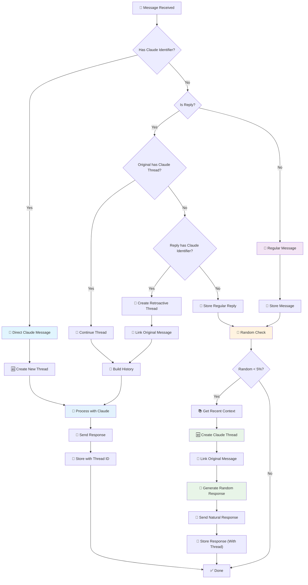

# Claude Bot Message Flow Diagram

This diagram illustrates how messages are processed by the Claude Telegram bot, including the new random participation feature.

## Flow Explanation

### Main Entry Points

- **📱 Message Received**: All incoming Telegram messages start here
- **🎯 Direct Claude Message**: Messages that explicitly mention Claude
- **💬 Regular Message**: Normal chat messages without Claude identifiers

### Decision Points

- **Has Claude Identifier?**: Checks for "claude", "hey claude", etc.
- **Is Reply?**: Determines if the message is replying to another message
- **Original has Claude Thread?**: Checks if the replied-to message is part of a Claude conversation
- **Random < 5%?**: Random number generation for spontaneous Claude participation

### Key Features

1. **Threaded Conversations**: Formal Claude conversations with full history
2. **Retroactive Threading**: Smart linking of existing messages to new Claude threads
3. **Random Participation**: Claude spontaneously joins regular conversations AND replies (5% chance)
4. **Random Response Threading**: Random responses automatically create Claude threads for follow-up conversations
5. **Context Awareness**: Uses recent message history for natural responses

### Color Coding

- 🔵 **Blue (Direct Claude)**: Formal Claude conversations with threading
- 🟣 **Purple (Regular Messages)**: Normal chat messages
- 🟠 **Orange (Random Check)**: Random participation decision point
- 🟢 **Green (Random Response)**: Spontaneous Claude participation
- 🔵 **Light Blue (Processing)**: Claude API processing and response generation

This system enables Claude to participate naturally in group conversations while maintaining organized threaded discussions when explicitly invoked.
